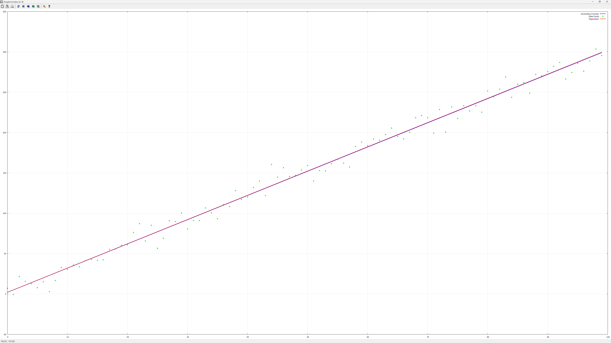
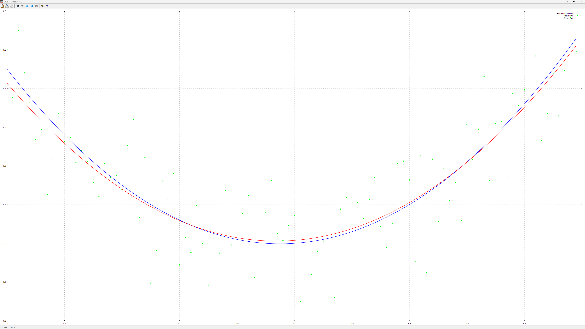
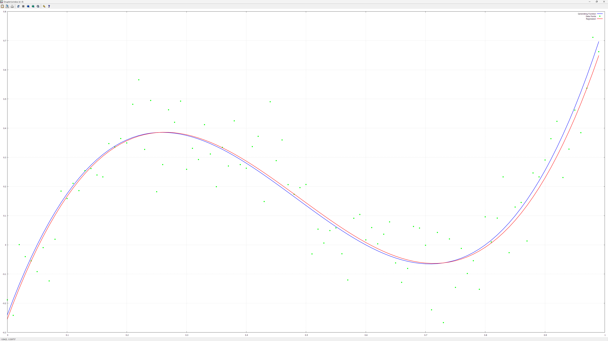
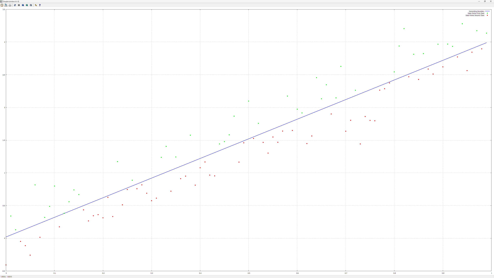
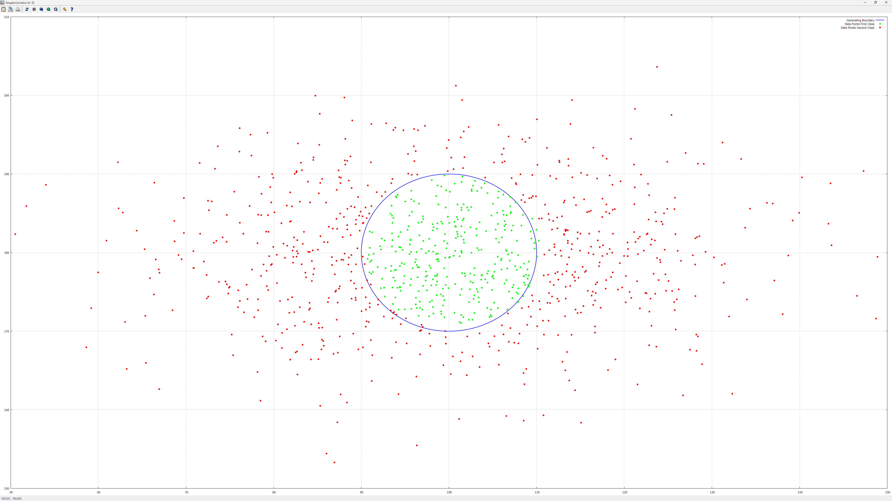

# MachineLearning
From linear regression towards neural networks...

[](https://app.codacy.com/gh/aromanro/MachineLearning/dashboard?utm_source=gh&utm_medium=referral&utm_content=&utm_campaign=Badge_grade)
[](https://www.codefactor.io/repository/github/aromanro/machinelearning/overview/master)

### Rationale

I've seen plenty of misconceptions about neural networks on some reddit groups and on some forums and although the subject is dealt a lot all over internet, I intend to add here some code starting from linear regression and going towards neural networks, from 'zero' (using Eigen for linear algebra probably, but not some machine learning library). Obviously I won't touch a lot of other machine learning subjects, despite being important, there are simply too many of them to cover a significant part of them.

Maybe I won't touch here something related directly with physics, but since data analysis is important to physics, too, I added this repository here along with the other physics-related ones.

Neural networks are in fashion nowadays, but of course the best method might not be a neural network, it depends on the data involved. Domain knowledge is very important and depending on the subject, it can lead to better algorithms than simply blindly using something that's in fashion.

See for example how this competition (physics related) was won: https://www.kaggle.com/competitions/trackml-particle-identification

### Introduction

The goal of this project is to build models starting from a very simple one and making them more complex up to a neural network. For now only up to a multilayer perceptron, but maybe I'll extend it in the future. I added some possible enhancements to 'Issues', maybe I'll implement some of them sometime.

I'll provide here only links to wikipedia as a start for the theory and some links to the code, to point out the places one should look for the implementation details.

If you would try to compile and execute the code, you will need to have the [Eigen library](https://eigen.tuxfamily.org/) installed and if you want the program to display the charts, also you'll need to install Gnuplot (and add it to the PATH). For examples, you'll need to download the iris and the EMNIST datasets.

One thing I should mention here is that in order to simplify the template parameters, I have the activation and loss functions specified in the solvers instead of the models as one would expect. Perhaps I will refactor sometime the code to have it more intuitive, but for now it seems to work fine as it is and I would rather prefer to extend the project with convolutional networks than to fix something that works.

Another thing that I don't want to repeat in many places is that - unless specified otherwise - the L2 loss is used. The [loss functions](https://en.wikipedia.org/wiki/Loss_function) are implemented in [CostFunctions.h](MachineLearning/MachineLearning/CostFunctions.h).

### A warning

With the default hyperparameters, computing can take quite some time for training the multilayer perceptron on the EMNIST dataset. If you want to try it as it is, you should have min 32 gigabytes of RAM and a quite good processor. To use less memory, you should change to false (or simply remove) the parameter of the `ReadAllImagesAndLabels` call in `NeuralNetworkTestsMNIST`. As it is, the training dataset is increased to 5x the size of the original dataset by augmenting the data (simply a single pixel offset in the horizontal and vertical directions). Also you might want to reduce the number of the traing epochs.
The project has openmp and AVX2 turned on, it will use close to 100% all the cores, when training.

### Some utility classes

There are some charts displayed with Gnuplot, the implementation for that is in [Gnuplot.h](MachineLearning/MachineLearning/Gnuplot.h) and [Gnuplot.cpp](MachineLearning/MachineLearning/Gnuplot.cpp). As the Iris dataset is in csv files, I implements a (very, very basic, it doesn't work in general with csv files, but it's good enough for its purpose) csv file loader along with a derived `IrisDataset` class in [CSVDataFile.h](MachineLearning/MachineLearning/CSVDataFile.h). 
I also used the EMNIST dataset (only digits for now), so I implemented a `MNISTDatabase` class in [MNISTDatabase.h](MachineLearning/MachineLearning/MNISTDatabase.h) and some utility functions in [EMNISTData.cpp](MachineLearning/MachineLearning/EMNISTData.cpp).

#### Simple Linear regression

As the name suggests, it's simple. One input, one output, linear. Wikipedia link: [simple linear regression](https://en.wikipedia.org/wiki/Simple_linear_regression).

The implementation is in [SimpleLinearRegression.h](MachineLearning/MachineLearning/SimpleLinearRegression.h) and [SimpleLinearRegressionSolver.h](MachineLearning/MachineLearning/SimpleLinearRegressionSolver.h). The reason for having a separate class for the solver is that for the next - not so simple - models, there are several stochastic gradient solvers that work for all of them, so I had a similarly separate implementation for this particular case as well, although it wouldn't really be needed. I implemented the simple linear regression not only for the one input one output case, but also for n inputs, n ouptuts, it's just a bunch of independant simple linear models.

How they are used can be seen in [LinearRegressionTests.cpp](MachineLearning/MachineLearning/LinearRegressionTests.cpp), `Test1` function.

Here is a chart I've got with it:



#### General Linear regression

It's time to go to a more complex model, with multiple inputs and multiple outputs and a little more than simply a bunch of simple linear regressions together. Here is the wikipedia link: [General Linear model](https://en.wikipedia.org/wiki/General_linear_model).
The implementation is in [GeneralizedLinearModel.h](MachineLearning/MachineLearning/GeneralizedLinearModel.h). It contains the implementation of the Generalized Linear models, subject of the next section, but for the general linear regression case, just ignore the activation function, it's the identity function.
For this and the following models, I implemented some [stochastic gradient descent](https://en.wikipedia.org/wiki/Stochastic_gradient_descent) solvers: a simple gradient solver, a momentum one, AdaGrad, RMSProp and Adam. Here is their implementation: [GradientSolvers.h](MachineLearning/MachineLearning/GradientSolvers.h). I also have them implemented in python (along with some others that 'look ahead'), here: [PythonCompphys](https://github.com/aromanro/PythonCompphys) in `dft.ipynb` (the section that begins with the comment "The following gradient-descent derived methods are not in the lecture or assignments").

Usage is in [LinearRegressionTests.cpp](MachineLearning/MachineLearning/LinearRegressionTests.cpp), `Test2` function.

##### Polynomial regression

A misconception can arise from the terminology, 'linear' typically means linear in the parameters, not necesarily in the inputs (unless explicitely specified). One can apply nonlinear functions on inputs, for example add powers of the features or by multiplying some features together. This way one can do [Polynomial regression](https://en.wikipedia.org/wiki/Polynomial_regression).

You'll find examples of it in [LinearRegressionTests.cpp](MachineLearning/MachineLearning/LinearRegressionTests.cpp), `Test3` and `Test4` functions.

Here are some charts I've got with that code:




#### Generalized linear regression

The [generalized linear model](https://en.wikipedia.org/wiki/Generalized_linear_model) has the same implementation as the general linear regression, pointed above, because the general linear model is just a special case. The generalized linear model allows applying a function on the output and that's about it.

##### Logistic regression

The [logistic regression](https://en.wikipedia.org/wiki/Logistic_regression) is one special case of the generalized linear regression: the output function is the [sigmoid function](https://en.wikipedia.org/wiki/Sigmoid_function) and the loss is the log loss. Implementation is in [LogisticRegression.h](MachineLearning/MachineLearning/LogisticRegression.h) and it's used in [LogisticRegressionTests.cpp](MachineLearning/MachineLearning/LogisticRegressionTests.cpp).
`SimpleLogisticRegressionTest` does something very simple, as the name suggests, that is it linearily separates two classes:



The `MoreComplexLogisticRegressionTest` uses a similar 'trick' as the one used for polynomial regression to obtain this:



I simply switched the inputs from cartesian coordinates to polar ones. In there you might also notice the `Normalizer` class usage, which will be used for now on to normalize the data, so here is its implementation: [Normalizer.h](MachineLearning/MachineLearning/Normalizer.h).

In the same cpp file there are also some tests on the Iris dataset and on the EMNIST dataset.

##### Softmax

A generalization of the logistic regression for the case when one has more than one output is [softmax](https://en.wikipedia.org/wiki/Softmax_function). The implementation is in [Softmax.h](MachineLearning/MachineLearning/Softmax.h). Because it's a particular case of generalized linear regression there isn't much into it, just specifying the activation and loss functions.
Applying the model on the Iris and EMNIST datasets is exemplified in [SoftmaxTests.cpp](MachineLearning/MachineLearning/SoftmaxTests.cpp).

Here is an example of the program output for this part (the logistic one is similar, so I didn't show it here):

```
Softmax:


Softmax for the Iris dataset, Setosa is lineary separable from the other two, but the others two cannot be linearly separated, so expect good results for Setosa but not for the other two

Loss: 1.09861
Loss: 0.302806
Loss: 0.164494
Loss: 0.128115
Loss: 0.121517
Loss: 0.0824916
Loss: 0.0972706
Loss: 0.0830393
Loss: 0.0551352
Loss: 0.0465823
Loss: 0.0631816

Training set:

Setosa true positives: 34, true negatives: 66, false positives: 0, false negatives: 0
Setosa accuracy: 1
Setosa specificity: 1
Setosa precision: 1
Setosa recall: 1
Setosa F1 score: 1


Versicolor true positives: 26, true negatives: 72, false positives: 0, false negatives: 2
Versicolor accuracy: 0.98
Versicolor specificity: 1
Versicolor precision: 1
Versicolor recall: 0.928571
Versicolor F1 score: 0.962963


Virginica true positives: 38, true negatives: 60, false positives: 2, false negatives: 0
Virginica accuracy: 0.98
Virginica specificity: 0.967742
Virginica precision: 0.95
Virginica recall: 1
Virginica F1 score: 0.974359

Accuracy (% correct): 98%


Test set:

Setosa true positives: 16, true negatives: 34, false positives: 0, false negatives: 0
Setosa accuracy: 1
Setosa specificity: 1
Setosa precision: 1
Setosa recall: 1
Setosa F1 score: 1


Versicolor true positives: 20, true negatives: 28, false positives: 0, false negatives: 2
Versicolor accuracy: 0.96
Versicolor specificity: 1
Versicolor precision: 1
Versicolor recall: 0.909091
Versicolor F1 score: 0.952381


Virginica true positives: 12, true negatives: 36, false positives: 2, false negatives: 0
Virginica accuracy: 0.96
Virginica specificity: 0.947368
Virginica precision: 0.857143
Virginica recall: 1
Virginica F1 score: 0.923077

Accuracy (% correct): 96%

MNIST Softmax Regression Tests
Loss: 0.316286
Loss: 0.299246
Loss: 0.16085
Loss: 0.353467
Loss: 0.195487
Loss: 0.26126
Loss: 0.150779
Loss: 0.273319
Loss: 0.281684
Loss: 0.0936841
Loss: 0.240225
Loss: 0.230357
Loss: 0.146989
Loss: 0.159257
Loss: 0.164459
Loss: 0.120844
Loss: 0.268027
Loss: 0.252116
Loss: 0.176584
Loss: 0.156379

Training set:

0 true positives: 23108, true negatives: 215097, false positives: 903, false negatives: 892
0 accuracy: 0.992521
0 specificity: 0.995819
0 precision: 0.962392
0 recall: 0.962833
0 F1 score: 0.962613


1 true positives: 23412, true negatives: 215269, false positives: 731, false negatives: 588
1 accuracy: 0.994504
1 specificity: 0.996616
1 precision: 0.969722
1 recall: 0.9755
1 F1 score: 0.972602


2 true positives: 22512, true negatives: 214816, false positives: 1184, false negatives: 1488
2 accuracy: 0.988867
2 specificity: 0.994519
2 precision: 0.950034
2 recall: 0.938
2 F1 score: 0.943979


3 true positives: 22295, true negatives: 214461, false positives: 1539, false negatives: 1705
3 accuracy: 0.986483
3 specificity: 0.992875
3 precision: 0.935428
3 recall: 0.928958
3 F1 score: 0.932182


4 true positives: 22563, true negatives: 214475, false positives: 1525, false negatives: 1437
4 accuracy: 0.987658
4 specificity: 0.99294
4 precision: 0.93669
4 recall: 0.940125
4 F1 score: 0.938405


5 true positives: 21959, true negatives: 214107, false positives: 1893, false negatives: 2041
5 accuracy: 0.983608
5 specificity: 0.991236
5 precision: 0.920636
5 recall: 0.914958
5 F1 score: 0.917788


6 true positives: 23381, true negatives: 215078, false positives: 922, false negatives: 619
6 accuracy: 0.993579
6 specificity: 0.995731
6 precision: 0.962062
6 recall: 0.974208
6 F1 score: 0.968097


7 true positives: 22880, true negatives: 215020, false positives: 980, false negatives: 1120
7 accuracy: 0.99125
7 specificity: 0.995463
7 precision: 0.958927
7 recall: 0.953333
7 F1 score: 0.956122


8 true positives: 22036, true negatives: 214194, false positives: 1806, false negatives: 1964
8 accuracy: 0.984292
8 specificity: 0.991639
8 precision: 0.924251
8 recall: 0.918167
8 F1 score: 0.921199


9 true positives: 22460, true negatives: 214089, false positives: 1911, false negatives: 1540
9 accuracy: 0.985621
9 specificity: 0.991153
9 precision: 0.921587
9 recall: 0.935833
9 F1 score: 0.928656

Accuracy (% correct): 94.4192%

Test set:

0 true positives: 3854, true negatives: 35846, false positives: 154, false negatives: 146
0 accuracy: 0.9925
0 specificity: 0.995722
0 precision: 0.961577
0 recall: 0.9635
0 F1 score: 0.962537


1 true positives: 3876, true negatives: 35871, false positives: 129, false negatives: 124
1 accuracy: 0.993675
1 specificity: 0.996417
1 precision: 0.96779
1 recall: 0.969
1 F1 score: 0.968395


2 true positives: 3761, true negatives: 35806, false positives: 194, false negatives: 239
2 accuracy: 0.989175
2 specificity: 0.994611
2 precision: 0.950948
2 recall: 0.94025
2 F1 score: 0.945569


3 true positives: 3716, true negatives: 35713, false positives: 287, false negatives: 284
3 accuracy: 0.985725
3 specificity: 0.992028
3 precision: 0.928304
3 recall: 0.929
3 F1 score: 0.928652


4 true positives: 3756, true negatives: 35729, false positives: 271, false negatives: 244
4 accuracy: 0.987125
4 specificity: 0.992472
4 precision: 0.932704
4 recall: 0.939
4 F1 score: 0.935842


5 true positives: 3650, true negatives: 35691, false positives: 309, false negatives: 350
5 accuracy: 0.983525
5 specificity: 0.991417
5 precision: 0.92195
5 recall: 0.9125
5 F1 score: 0.917201


6 true positives: 3888, true negatives: 35836, false positives: 164, false negatives: 112
6 accuracy: 0.9931
6 specificity: 0.995444
6 precision: 0.959526
6 recall: 0.972
6 F1 score: 0.965723


7 true positives: 3833, true negatives: 35836, false positives: 164, false negatives: 167
7 accuracy: 0.991725
7 specificity: 0.995444
7 precision: 0.958969
7 recall: 0.95825
7 F1 score: 0.958609


8 true positives: 3647, true negatives: 35687, false positives: 313, false negatives: 353
8 accuracy: 0.98335
8 specificity: 0.991306
8 precision: 0.92096
8 recall: 0.91175
8 F1 score: 0.916332


9 true positives: 3726, true negatives: 35692, false positives: 308, false negatives: 274
9 accuracy: 0.98545
9 specificity: 0.991444
9 precision: 0.923649
9 recall: 0.9315
9 F1 score: 0.927558

Accuracy (% correct): 94.2675%
```

Not bad at all for such a simple model, isn't it?

By the way, some stats that are displayed are calculated with the help of `TestStatistics` class, with implementation in [TestStatistics.h](MachineLearning/MachineLearning/TestStatistics.h).

### Neural networks

At this point, things are ready for implementing a neural network. Without much ado, here is the typical neuron implementation: [Neuron.h](MachineLearning/MachineLearning/Neuron.h). Quite simple, it's just a generalized linear model with a single output. This implementation is not used anywhere (yet?) in the code, it's there just as an example. For the multilayer perceptron I chose to use a single generalized linear model for the whole layer. Details below.

#### The multilayer perceptron

Here it is, the goal I estabilished when I started this project (I might go further in the future, but for now it should do): the [multilayer perceptron](https://en.wikipedia.org/wiki/Multilayer_perceptron).
The implementation starts with [NeuralSublayer](MachineLearning/MachineLearning/NeuralSublayer.h) which adds very little to the generalized linear model from which it is derived (but there is some functionality needed for neural models already added to the generalized linear model implementation). The reason I have the 'sublayer' and not directly a layer implementation is that in some cases a layer might need more than one such 'sublayer'. It's not yet needed in this project, but it can be the case, for example you might want an output layer with a softmax classification and also some other regression in there, with some other activation function.
A layer for the multilayer perceptron is implemented in [NeuralLayer.h](MachineLearning/MachineLearning/NeuralLayer.h). It's just a decorator (mostly a proxy, actually) for a single 'sublayer' and that's about it. The multilayer perceptron is implemented in [NeuralNetwork.h](MachineLearning/MachineLearning/NeuralNetwork.h).
It contains the last layer and the hidden layers and adds some implementation for prediction, forward/backward step, saving/loading the model, initialization, dropout and so on. 

##### XOR

The multilayer perceptron usage is exemplified in [NeuralNetworkTests.cpp](MachineLearning/MachineLearning/NeuralNetworkTests.cpp). The `XORNeuralNetworksTests` function exemplifies it for a XOR, a simple but not so trivial example. It cannot be solved with a single neuron (unless you use some 'triks' like here: https://arxiv.org/abs/2108.12943 or here: https://arxiv.org/abs/2110.06871v1), you need two layers, a hidden one with two neurons and the output one with a single neuron. There is some nasty issue that the problem has local minimums where the neural network can get 'stuck', so I implemented an initializer that initializes the weights to some random values that avoid starting in such position (but it still could get there with a big enough learn rate).
The `XORNeuralNetworksTests` function repeats the same thing twice: once explicitely, without using the `MultilayerPerceptron` class, but a `LogisticRegression` object for the last layer and a `GeneralizedLinearModel` object for the hidden layer... and once as expected, using a `MultilayerPerceptron` object. The reason is that I implemented the first part before having any neural network code implemented yet and I thought it could be helpful to let it there to see how those things can implement a neural network, without having to look into the neural network implementation code.

##### Iris dataset

The multilayer perceptron usage on the Iris dataset is in `IrisNeuralNetworkTest`. There isn't much to say about this, it resembles the logistic and softmax tests, but it uses the neural network instead.

##### EMNIST dataset

Implementation of the test is in `NeuralNetworkTestsMNIST`. The training data can be loaded 'as is' or it can be augmented. At first I also added a way to regularize by adding noise to the training images (see the code with `#ifdef ADD_NOISE`) but then I decided to add dropout, this one not only can 'drop' the pixels in the training images, but can also 'drop' outputs from neurons. 
It's also a kind of regularization and can be thought as training multiple neural networks together and averaging them (as in 'ensemble learning') so it can improve results quite a bit. 
I didn't play much with the hyperparameters, I played a little first with a simpler network then I switched to the more complex one that is currently in the code. 
I reached something like 98.9% accuracy on the test set, which is ok for the purpose of this project (details here: https://arxiv.org/abs/1702.05373 and here: https://paperswithcode.com/dataset/emnist).
I don't think that as it is it can go much better, unless implementing convolutional networks or perhaps training a denoising autoencoder then using the encoder part with at least a softmax added on top to train further... anyway, those are things postponed for later.

### Bibliography

A selection of freely available books:

* [The Elements of Statistical Learning](https://hastie.su.domains/ElemStatLearn/)

* [Pattern Recognition and Machine Learning](https://www.microsoft.com/en-us/research/publication/pattern-recognition-machine-learning/)

* [Probabilistic Machine Learning: An Introduction](https://probml.github.io/pml-book/book1.html)

* [Probabilistic Machine Learning: Advanced Topics](https://probml.github.io/pml-book/book2.html)

* [Deep Learning](https://www.deeplearningbook.org/)


